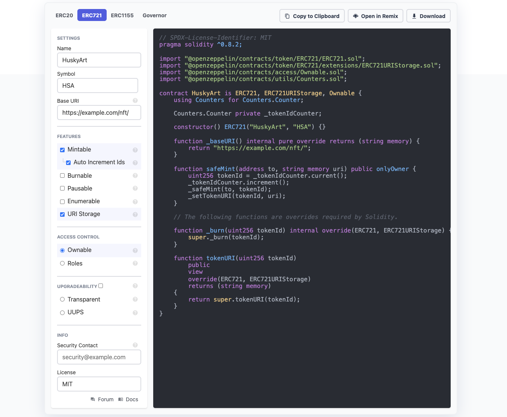
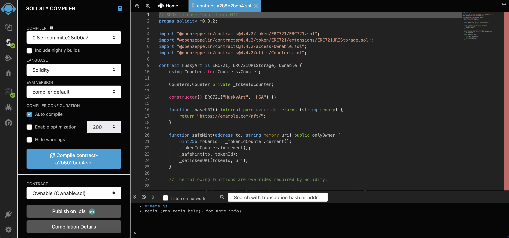
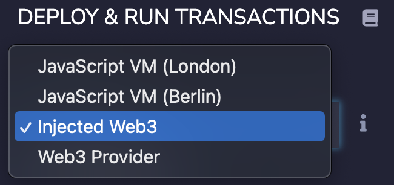
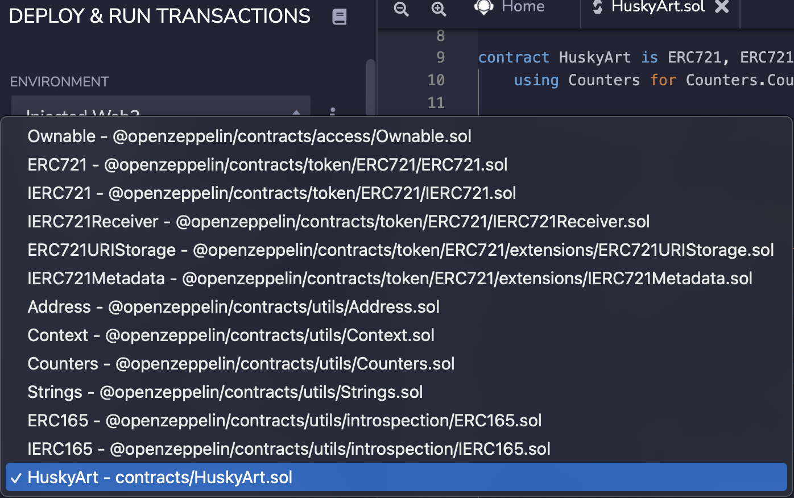
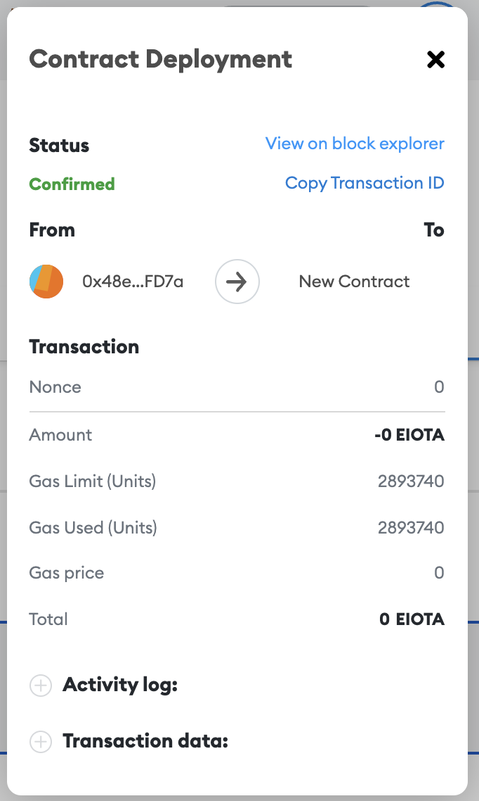

Non-fungible tokens or NFTs are a type of token that can represent any unique object including a real world asset on a decentralised network.


# Prerequisites

- What is token?
- What is blockchain?
- What are ERCs?
- What is NFT?
- What is a smart contract?
- How to get started with Solidity?


# About ERC721

NFT are most commonly represented with ([ERC721 standard](https://eips.ethereum.org/EIPS/eip-721)). To simplify further we will use openzepplin lib `@openzeppelin/contracts/token/ERC721/ERC721.sol`.

You can also use ([OpenZepplin Contracts Wizard](https://wizard.openzeppelin.com/#erc721)) to generate and customise it:

We are going to call our NFT Smart Contract as "HuskyArt":

```solidity
// SPDX-License-Identifier: MIT
pragma solidity ^0.8.2;

import "@openzeppelin/contracts/token/ERC721/ERC721.sol";
import "@openzeppelin/contracts/token/ERC721/extensions/ERC721URIStorage.sol";
import "@openzeppelin/contracts/access/Ownable.sol";
import "@openzeppelin/contracts/utils/Counters.sol";

contract HuskyArt is ERC721, ERC721URIStorage, Ownable {
    using Counters for Counters.Counter;

    Counters.Counter private _tokenIdCounter;

    constructor() ERC721("HuskyArt", "HSA") {}

    function _baseURI() internal pure override returns (string memory) {
        return "https://example.com/nft/";
    }

    function safeMint(address to, string memory uri) public onlyOwner {
        uint256 tokenId = _tokenIdCounter.current();
        _tokenIdCounter.increment();
        _safeMint(to, tokenId);
        _setTokenURI(tokenId, uri);
    }

    // The following functions are overrides required by Solidity.

    function _burn(uint256 tokenId) internal override(ERC721, ERC721URIStorage) {
        super._burn(tokenId);
    }

    function tokenURI(uint256 tokenId)
        public
        view
        override(ERC721, ERC721URIStorage)
        returns (string memory)
    {
        return super.tokenURI(tokenId);
    }
}
```

As you can see above, we're mostly using all standard methods. Some stuff to notice here:

- `pragma solidity ^0.8.2;` This means that we're using solidity compiler version 0.8.2 and anything above that should be fine.
- `constructor() ERC721("HuskyArt", "HSA") {}` We define our token name and symbol. You can name it whatever you want. Best practice would be name the token and contract name as same one.
- We're using auto-incremental token ids here. `import "@openzeppelin/contracts/utils/Counters.sol";` lib ensures that it keeps incrementing in that order.
- `return "https://example.com/nft/";` You can define what the base URI of your NFTs would be. That means the url we provide here would be considered for all tokens going forward. Since, we're using auto-incremental token ids, our token uri would look something like `https://example.com/nft/0`, `https://example.com/nft/1`, `https://example.com/nft/2`, and so on.
- `function safeMint(address to, string memory uri) public onlyOwner {` is the safeMint function. However, this function would require us to provide manually a `to` address and a `uri` of the token everytime we would want to mint. This should work for regular use-cases.
- Don't worry too much about the license part. `// SPDX-License-Identifier: MIT` If you want to keep it unlicensed, you can also write as `// SPDX-License-Identifier: Unlicensed`.



We can customise further depending on what we would want based on primarily the following:

1. Ownership — Who owns it and how is it stored?
2. Creation — Method or Type of Creation.
3. Transfer & Allowance — How are tokens transferred and how would it be available to other addresses and accounts.
4. Burn — Do we destroy it? If yes, how?

Now, you can either click on Copy to Clipboard and paste it in the IDE of your choice, or Download it, or click on open in Remix directly. We're going to use Remix for this exercise.


# Compile

Compile your Smart Contract to generate the ABI and Bytecode. 



You can check Auto compile so that you won't have to compile manually with every change you make

So, our smart contract is ready now to be deployed.


# Deploy

Connect your IDE to the network where you'd want to deploy the smart contract on. If you're using hardhat or truffle, you can customise the config file accordingly.

We'll be using [Remix IDE](https://remix.ethereum.org/) with [Metamask](https://metamask.io/) for the same.

Connect to the ISCP Testnet using the endpoints as mentioned ([here](https://wiki.iota.org/smart-contracts/guide/chains_and_nodes/testnet#endpoints)).

Once done, change the environment to Injected Web3.



Wait for the IDE to sync in. If it doesn't, just refresh and try again.

Once this is done, Select your Smart Contract from the dropdown. Ideally, you might seen only one option here. However, since we've imported quite a few libs those show up by default.



Click on Deploy. This should open the Metamask and ask you to sign the transaction. Please do so and wait for confirmation.


If you see something like this, your contract is now deployed. You can view the same on the explorer. You can explore more from Metamask.



Please Note that the node I'm using has 0 gas fee set. However, depending on which node you're deploying to, there might have some gas fee involved.

The above smart contract is generated by OpenZepplin Wizard and is of course good enough to be used. However, we usually want something more added to it. Some modifications that you can try out can be:

## Possible Next Steps
- Add Royalty for every transfer done after minting.


# Where to go from here

- [OpenZepplin 721 Standard](https://docs.openzeppelin.com/contracts/2.x/api/token/erc721)

